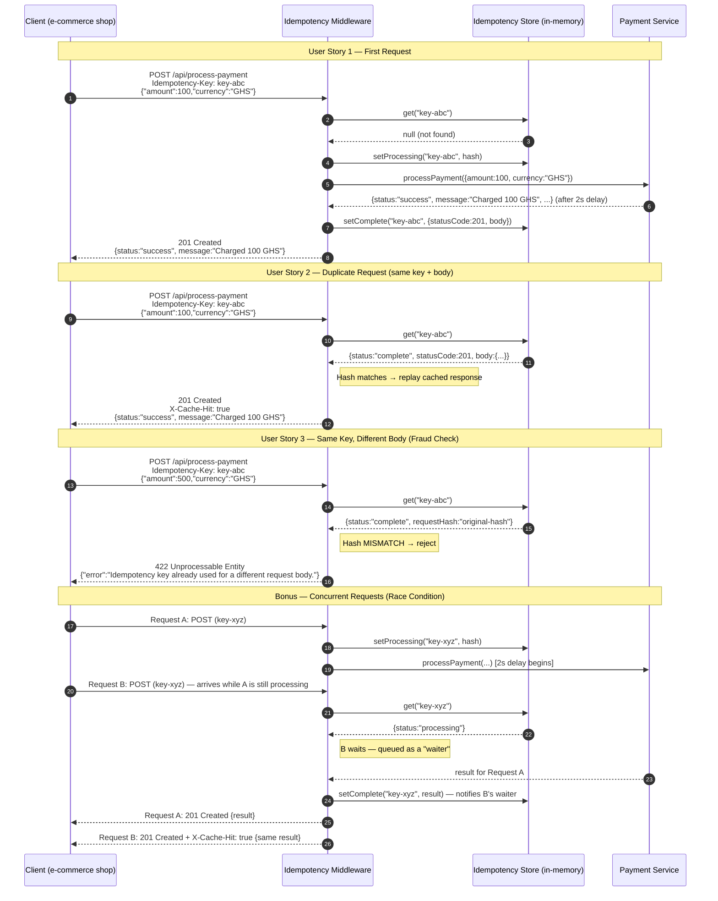

# FinSafe Idempotency Gateway

A production-ready **Idempotency Layer** built with Node.js + Express that ensures payment requests are processed **exactly once** — no matter how many times a client retries.

---

## Table of Contents

1. [Architecture Diagram](#architecture-diagram)
2. [Setup Instructions](#setup-instructions)
3. [API Documentation](#api-documentation)
4. [Design Decisions](#design-decisions)
5. [Developer's Choice Feature — TTL Key Expiry](#developers-choice-feature--ttl-key-expiry)

---

## Architecture Diagram

The sequence below shows all three user stories plus the race-condition bonus within a single flow.



### Flowchart — Decision Logic Inside the Middleware

```
Incoming POST /api/process-payment
           │
           ▼
  ┌─────────────────────────────┐
  │  Idempotency-Key header     │
  │  present?                   │
  └────────┬────────────────────┘
      NO   │   YES
       ▼   │
    400    ▼
  ┌──────────────────────────────┐
  │  Look up key in store        │
  └───┬──────────┬───────────────┘
      │          │
   NOT FOUND   FOUND
      │          │
      ▼          ├──── requestHash DIFFERS ──► 422 Conflict
  Mark as        │
  Processing     ├──── status = "processing" ──► Wait (Promise)
  → next()       │                                      │
                 │                                   result
                 │                                      │
                 └──── status = "complete" ─────────────┤
                            same hash                   ▼
                                               201 + X-Cache-Hit: true
                                               (cached response replayed)
```

---

## Setup Instructions

### Prerequisites

- Node.js v18+ and npm

### Install

```bash
git clone <your-repo-url>
cd finsef_idem_layer_api
npm install
```

### Run

```bash
# Production
npm start

# Development (auto-restart on file changes)
npm run dev
```

Server starts at: `http://localhost:3000`

To use a different port:

```bash
PORT=8080 npm start
```

---

## API Documentation

### Base URL

```
http://localhost:3000
```

---

### `POST /api/process-payment`

Process a payment. The `Idempotency-Key` header ensures the payment is charged exactly once regardless of retries.

#### Request Headers

| Header            | Type   | Required | Description                                                    |
|-------------------|--------|----------|----------------------------------------------------------------|
| `Idempotency-Key` | string | Yes      | A unique identifier generated by the client (e.g., a UUID v4) |
| `Content-Type`    | string | Yes      | Must be `application/json`                                    |

#### Request Body

```json
{
  "amount": 100,
  "currency": "GHS"
}
```

| Field      | Type   | Required | Description                              |
|------------|--------|----------|------------------------------------------|
| `amount`   | number | Yes      | Positive numeric amount to charge        |
| `currency` | string | Yes      | Currency code (e.g., `"GHS"`, `"USD"`)  |

---

#### Response — 201 Created (First Request)

```json
{
  "status": "success",
  "message": "Charged 100 GHS",
  "transactionId": "f47ac10b-58cc-4372-a567-0e02b2c3d479",
  "amount": 100,
  "currency": "GHS",
  "processedAt": "2026-03-12T10:45:00.000Z"
}
```

---

#### Response — 201 Created + `X-Cache-Hit: true` (Duplicate / Retry)

The **exact same body** as the first response is returned. No charge occurs again.

```
HTTP/1.1 201 Created
X-Cache-Hit: true
```

```json
{
  "status": "success",
  "message": "Charged 100 GHS",
  "transactionId": "f47ac10b-58cc-4372-a567-0e02b2c3d479",
  "amount": 100,
  "currency": "GHS",
  "processedAt": "2026-03-12T10:45:00.000Z"
}
```

---

#### Response — 422 Unprocessable Entity (Key Reused With Different Body)

```json
{
  "error": "Idempotency key already used for a different request body."
}
```

---

#### Response — 400 Bad Request (Missing Header or Fields)

```json
{ "error": "Missing required header: Idempotency-Key" }
```

```json
{ "error": "\"amount\" must be a positive number." }
```

---

### `GET /health`

Liveness probe.

```json
{ "status": "ok", "timestamp": "2026-03-12T10:45:00.000Z" }
```

---

### Example — curl

```bash
# ── First request ─────────────────────────────────────────────────────────────
curl -X POST http://localhost:3000/api/process-payment \
  -H "Content-Type: application/json" \
  -H "Idempotency-Key: unique-key-001" \
  -d '{"amount": 100, "currency": "GHS"}'

# ── Retry (duplicate) — returns cached response immediately ───────────────────
curl -X POST http://localhost:3000/api/process-payment \
  -H "Content-Type: application/json" \
  -H "Idempotency-Key: unique-key-001" \
  -d '{"amount": 100, "currency": "GHS"}'

# ── Fraud check — same key, different body ────────────────────────────────────
curl -X POST http://localhost:3000/api/process-payment \
  -H "Content-Type: application/json" \
  -H "Idempotency-Key: unique-key-001" \
  -d '{"amount": 500, "currency": "GHS"}'
```

---

## Design Decisions

### 1. In-Memory Store with a Redis-Compatible Interface

The store (`src/store/idempotencyStore.js`) is built with a clean, minimal API (`get`, `setProcessing`, `setComplete`, `setFailed`, `waitForResult`). Swapping it for Redis requires only replacing this one file — all other code is unaffected. Using an in-memory store is appropriate for a single-node assessment environment.

### 2. Deterministic Request Body Hashing (US3)

The body is hashed using SHA-256 after **sorting keys alphabetically**. This means `{"amount":100,"currency":"GHS"}` and `{"currency":"GHS","amount":100}` produce the **same hash**, preventing false fraud alerts caused by JSON serialization order differences between clients.

### 3. Promise-Based Waiter Queue (Bonus — Race Condition)

When Request B arrives with the same key while Request A is still processing, B is added to a `waiters` array on the store entry (a resolve-callback queue). When `setComplete` is called for A's result, it iterates the array and resolves every queued Promise. No polling, no extra server round-trips — O(1) notification.

### 4. Fail-Open on Processing Errors

If a request fails mid-flight (unhandled exception), `setFailed` removes the key entirely and notifies any waiters with `null`. This allows the client to **retry with a new key** rather than being permanently blocked by a poisoned entry.

### 5. Input Validation Before Processing

The route validates `amount` and `currency` **before** calling the payment service. Invalid requests immediately call `setFailed` on the store so stale processing entries are never left behind.

---

## Developer's Choice Feature — TTL Key Expiry

### What It Is

Every idempotency key automatically expires after **24 hours** (configurable via `IDEMPOTENCY_TTL_MS` in `src/store/idempotencyStore.js`).

### Why It Matters

In a real Fintech system, storing idempotency keys forever has two problems:

| Problem | Consequence |
|---|---|
| **Memory leak** | A long-running server accumulates millions of keys, eventually crashing |
| **Stale key confusion** | A key from 6 months ago being replayed makes no sense in the context of an active payment flow |

This matches **Stripe's production behaviour** — their idempotency keys also expire after 24 hours, after which a new key must be used.

### Implementation

- **Lazy eviction**: Every `get(key)` call checks `Date.now() - entry.createdAt > TTL`. If expired, the entry is deleted before returning `null`.
- **Active sweep**: A `setInterval` runs every hour to evict all expired entries in the background — preventing memory accumulation even for keys that are never read again.
- The sweep timer calls `.unref()` so it **never prevents the Node.js process from exiting cleanly**.

---

## Project Structure

```
src/
├── server.js               ← Express app entry point
├── routes/
│   └── payments.js         ← POST /api/process-payment
├── middleware/
│   └── idempotency.js      ← Core idempotency check (all user stories)
├── store/
│   └── idempotencyStore.js ← In-memory key/response store with TTL
└── services/
    └── paymentService.js   ← Simulated 2-second payment processing
```
